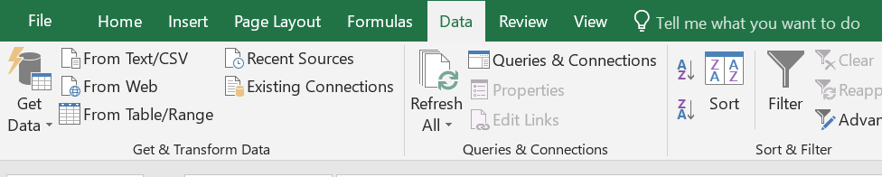

# Introduction
This project is a scraping tutorial for beginners. We use a structurally simple website, hkcib.org, to demonstrate the basic elements of scraping, namely download, parse, and export.

# Quickstart
Open terminal and type:
```
pip install selenium
```
Selenium is the only external Python package used in this tutorial. It is a framework for developing browser robots, with it you can make a robot to navigate webpages like human.

The second step is to make sure you have a Chrome browser and a Chrome driver installed on your computer. Simply place the Chrome driver in your Python directory.

First we will download the .html files. On your terminal, make sure you're on the working directory holding scrape.py in the terminal. Run:
```
.\scrape.py
```
If you type s and then press Tab, Windows will complete the full command for you. Keep pressing the Tab key until you see what you need.

You'll see a folder called MemberDetails being created. It holds all the downloaded .html files.

Next run:
```
.\parse.py
```
After running the file, you'll see hkcib_results.csv. The file is Big5 encoded if run on a Windows machine. You can later import it to Excel.

Select Data on the tab, then click From Text/CSV:

