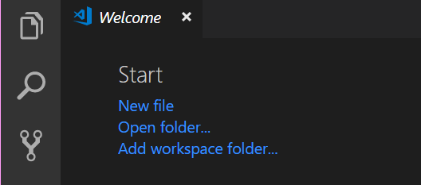
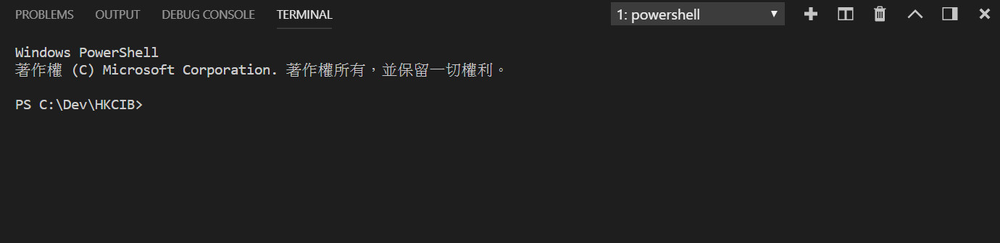
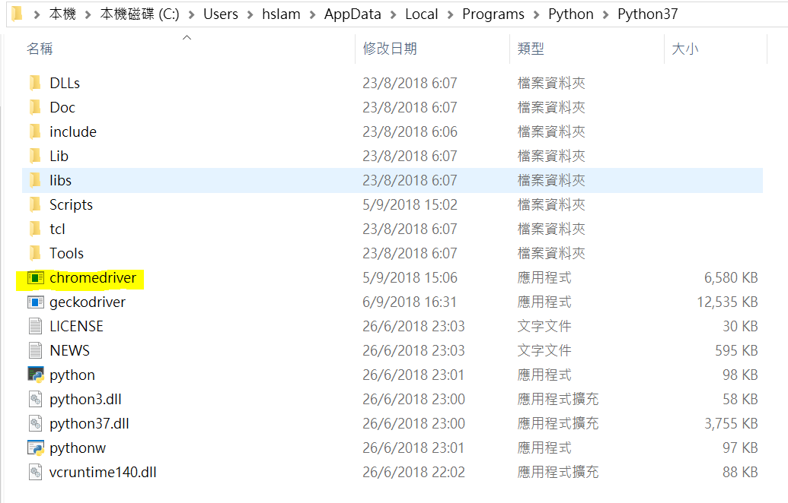

# Environment Setup
## Downloading Python
If you're using a 64-bit Windows, you can download the 64-bit version of Python from here: https://www.python.org/downloads/windows/.

Select the Windows x86-64 executable installer.

If you've installed a 32-bit Python before and wish to remove it, you can run your 32-bit Python installer again and select remove.

But since the difference between 32-bit and 64-bit Python is a matter of computational capacity, it doesn't really matter which one you use when you're doing a small web scraper.

## Creating an Empty Project Folder
Simply create a project folder in your computer.

For me I put my code here:
```
C:\Dev\HKCIB
```
I find that the shorter my working folder name is, the easier for me to remember where it is.

## Installing Visual Studio Code
Visual Studio Code (VS Code) is a free text editor created by Microsoft. Compared to Notepad++, it offers a more user-friendly environment, fancy extention packages, in-build debugger, and is under continuous support from professionals.

Get VS Code from the [official website](https://code.visualstudio.com/). Donwload the installer and run it.

After the installation, you can add a project folder to your working space. The project folder will hold your Python scripts and downloded .html files.

Select Add workspace folder:



Everytime you open VS Code, you will automatically see your last working project folder.

The next step is to open your terminal. A terminal is a place for you to type commands, with it you can display what's inside a folder, run a program, etc. Open one in VS Code by selecting Terminal in the top panel, and click new terminal.

Mine looks like this:



## Installing Selenium
In the terminal run:
```python
pip install selenium
```
pip is a Python tool that helps you download Python packages.

The next step is to install the Chrome browser driver.

Once you get the .exe of the driver, place it in the folder where Python is installed. Usually it's located in:
```
C:\Users\yourUsername\AppData\Local\Programs\Python\Python37
```
You can reach the \AppData folder by typing:
```
%AppData%
```
on the Windows serach engine. On my machine it looks like this:

