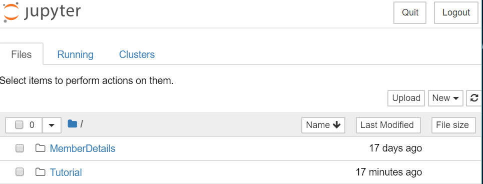
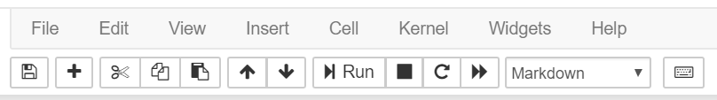
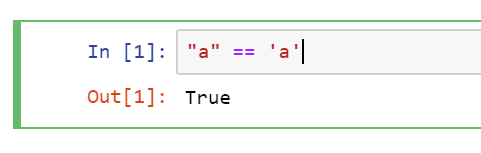

# What is Jupyter Notebook?
Jupyter notebook is an interactive Python console. It is a web-based application that allows users to capture the computaiton of each line of Python code. For this reason, I'm using it as a medium for delivering the Python tutorial.

# Installation
In your Windows terminal type:
```
pip install --upgrade pip
pip install jupyter
```
To run a Jupyter Notebook your browser, navigate to your project folder. Start the program by typing on the terminal (preferably on VS Code):
```
jupyter notebook
```
You should see a similar message:
```
 Copy/paste this URL into your browser when you connect for the first time,
to login with a token:
        http://localhost:8889/?token=95d7d6a3713ce5c5c82df608a719551c82acca85248a819b
[I 16:01:49.459 NotebookApp] Accepting one-time-token-authenticated connection from ::
```
Copy the displayed URL to a Chrome browser if it's not your default browser. Because Jupyter is optimized for Chrome.

Once it's opened, you'll see a Notebook Dashboard. On my machine it looks like:


Next download the tutorial 3 files ending with .ipynb and save it to your project folder.

Open the .ipynb file in Jupyter.

# Using the Notebook
On the top, you see the panel:



The Run button in the middle is the most important.

There're two modes in using the Notebook, namely view and edit. Click run to view the effect of each line of code. Click on the grey area of a line of code to edit.



Afterwards click run to see the effect.